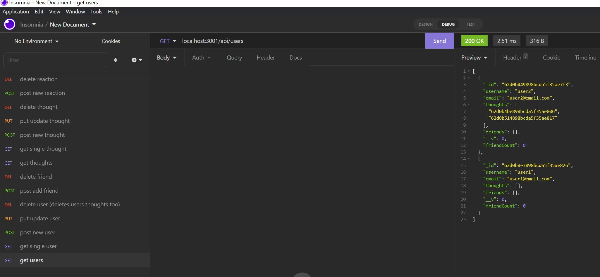

# theSuperSocialNetworkAPI

## Table of Contents

- [Description](#description)
- [Installation](#installation)
- [Usage](#usage)
- [Questions](#questions)
- [License](#license)
- [Walkthrough](#walkthough)
- [Screenshot](#screenshot)

## Description

This application demonstrates the API calls for a social network API. It can show the backend of creating, editing and deleting users, thoughts and reactions. The whole application is using Mongoose and MongoDB to store the data.

## Installation

You can clone the repository from this command:

```bash
git clone https://github.com/Zzaclipse/theSuperSocialNetworkAPI.git
```

## Usage

The application will be invoked in the command line by using the following command:

```bash
npm start
```

Once the application is started it you use the following routes in Insomnia to use the program:

**`/api/users`**

- `GET` all users

- `POST` a new user

**`/api/users/:userId`**

- `GET` a single user by its `_id`

- `PUT` to update a user by its `_id`

- `DELETE` to remove user by its `_id`

**`/api/users/:userId/friends/:friendId`**

- `POST` to add a new friend to a user's friend list

- `DELETE` to remove a friend from a user's friend list

---

**`/api/thoughts`**

- `GET` to get all thoughts

- `POST` to create a new thought

**`/api/thoughts/:thoughtId`**

- `GET` to get a single thought by its `_id`

- `PUT` to update a thought by its `_id`

- `DELETE` to remove a thought by its `_id`

---

**`/api/thoughts/:thoughtId/reactions`**

- `POST` to create a reaction

- `DELETE` to pull and remove a reaction by the reaction's `reactionId` value

## Questions

What is the developers github?

[Zzaclipse](https://github.com/Zzaclipse)

Where can I reach the developer to ask additional questions?

za.stokes@gmail.com

## License

This application is licened under ISC License

[](https://opensource.org/licenses/ISC)

## Walkthrough

[Video](https://drive.google.com/file/d/1mRsSBnFqybJtqcXLSP-n28dN65WitpZM/view)

## Screenshot


